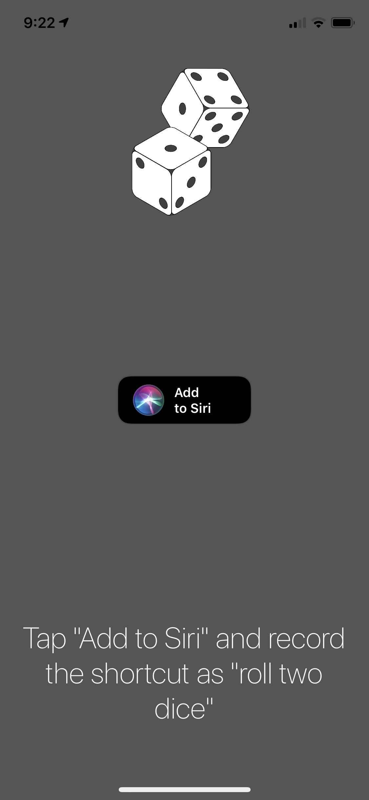
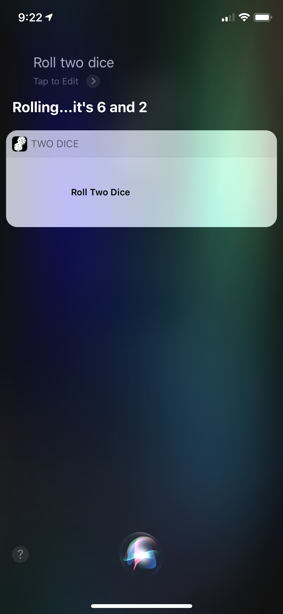

# TwoDice
### A Siri shortcut that always rolls 6 and 2

There is a colloquial phenomena where one can compell somebody else to do something if the aggressor is able to successfully roll two dice to land on 6 and 2. Most often, there aren't two dice laying around so you ask Siri to do it for you. This Siri shortcut ensures that Siri will always roll 6 and 2.

*Made in 1 night for a hackathon :-)*

